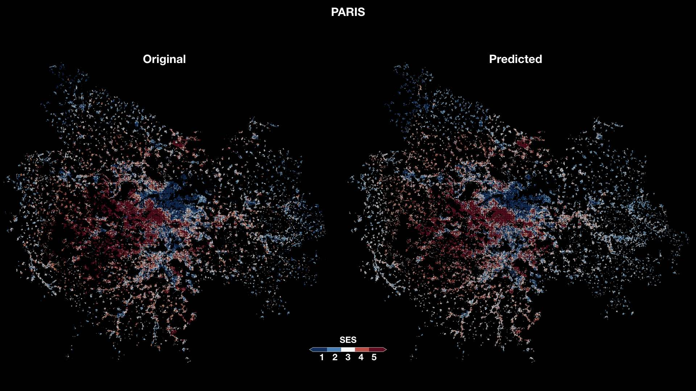

# Socioeconomic correlations of urban patterns inferred from aerial images: interpreting activation maps of Convolutional Neural Networks
This repository contains code related to the paper [Socioeconomic correlations of urban patterns inferred from aerial images: interpreting activation maps of Convolutional Neural Networks](http://perso.ens-lyon.fr/marton.karsai/) (currently in submission).

This repository contains the `Python` codes needed to prepare the data, train and apply the inference pipeline and project the models weights unto the land cover maps.

* code to generate semantics features, reliable home locations and ses-enriched datasets from users tweets and census, is in the [helpers](./python_scripts/helpers) folder

  

* `Keras` implementations of the `EfficientNet` used in this paper to select residential sites are in the [data collection and processing](./python_scripts/data_coll_process) folder (with a `TensorFlow` backend)

* code to train and validate the models, for each socioeconomic proxy in the [pipelines](./python_scripts/pipelines) folder.

### Citation
If you use the code, data, or analysis results in this paper, we kindly ask that you cite the paper above as:

> _Socioeconomic correlations of urban patterns inferred from aerial images: interpreting activation maps of Convolutional Neural Networks_ , J. Levy Abitbol, M. Karsai, 2020, arxiv-preprint.
